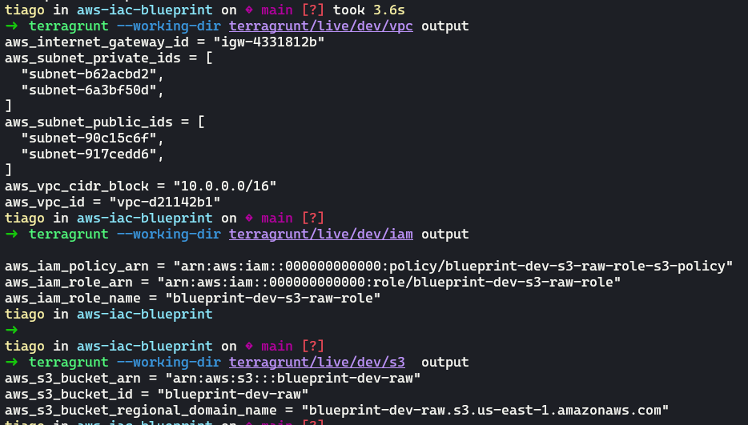
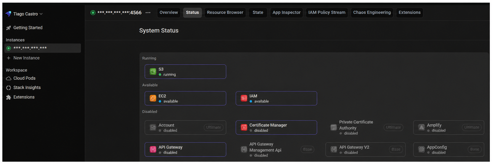

# AWS IaC Blueprint

> Portfolio / learning template. Infrastructure as Code with Terraform and Terragrunt on AWS.
> No real AWS account required. Validate and apply everything locally with LocalStack.


---

## What this is

A template that demonstrates how to structure a real-world IaC project where **all environments share the exact same infrastructure configuration**. The only difference between `dev`, `staging`, and `prod` is the values declared in each environment's `env.hcl`. Modules and orchestration logic are written once and reused everywhere.

- **Reusable Terraform modules** - no hardcoded values, no provider declarations, no `terraform {}` block; clean, testable units
- **Terragrunt orchestration** - injects provider, backend, and version constraints per environment via `root.hcl`
- **Environment isolation** - `_common/` holds module logic; `live/<env>/` holds one `env.hcl` per environment; adding `staging/` or `prod/` is one new file, zero module changes
- **LocalStack integration** - full `apply` -> inspect -> `destroy` cycle with no AWS account and no costs

---

## Resources provisioned

### VPC - `terraform/modules/vpc`

Network isolation layer. Provisions:

- **VPC** with DNS hostnames and DNS resolution enabled
- **Internet Gateway** attached to the VPC
- **Public subnets** (one per AZ) - routed to the internet gateway
- **Private subnets** (one per AZ) - isolated, no internet route
- **Route tables** with associations for both tiers

All networking values (CIDR blocks, availability zones) are required inputs with no defaults, so each environment declares its own addressing in `env.hcl`.

### S3 - `terraform/modules/s3`

Generic object storage bucket. Provisions:

- **S3 bucket** - name pattern: `<project>-<env>-<suffix>` (e.g., `blueprint-dev-raw`)
- **Versioning** - configurable per call
- **Server-side encryption** - AES256 at rest
- **Public access block** - all four controls enabled

The `layer` input accepts `raw`, `processed`, or `curated` and is validated at plan time.

### IAM - `terraform/modules/iam`

Least-privilege access role for S3. Provisions:

- **IAM role** - `trusted_services` list defines which AWS services can assume it
- **IAM policy** - `ListBucket` + `GetObject` / `PutObject` / `DeleteObject` on the target bucket
- **Role-policy attachment**

Policy documents are computed locally by `aws_iam_policy_document` with no AWS API calls during `validate` or `plan`.

---

## Project structure

```
.
├── terraform/
│   └── modules/
│       ├── vpc/          # VPC, subnets, route tables, IGW
│       ├── s3/           # S3 bucket (versioning, encryption, public-access block)
│       └── iam/          # IAM role + least-privilege S3 policy
│
├── terragrunt/
│   ├── global.hcl             # project_name, owner
│   ├── root.hcl               # generates versions.tf, provider.tf, backend.tf per module
│   ├── _common/               # module inputs shared across all environments
│   │   ├── vpc/terragrunt.hcl
│   │   ├── s3/terragrunt.hcl
│   │   └── iam/terragrunt.hcl
│   └── live/
│       └── dev/
│           ├── env.hcl              # region, account ID, CIDRs, LocalStack endpoint
│           ├── vpc/terragrunt.hcl   # 3 lines: include root + include _common/vpc
│           ├── s3/terragrunt.hcl
│           └── iam/terragrunt.hcl
│
├── localstack/
│   └── docker-compose.yml     # LocalStack Pro container
│
├── .env.example               # template - copy to .env and fill in values
└── .gitignore
```

---

## Config hierarchy

| File | Scope | Contains |
|------|-------|----------|
| `global.hcl` | All environments | `project_name`, `owner` |
| `root.hcl` | Every module | Provider, backend, version constraints |
| `_common/<mod>/terragrunt.hcl` | Every environment | Module source, inputs, dependencies |
| `live/<env>/env.hcl` | One environment | Region, account ID, CIDRs, skip-flags, `extra_tags` |
| `live/<env>/<mod>/terragrunt.hcl` | One env x module | 3 lines: include root + include _common |

**Adding a new environment** = create `live/staging/` with one `env.hcl` and three 3-line module files. Zero changes to modules or `root.hcl`.

### Dependency order

Terragrunt reads `dependency` blocks and builds the execution graph automatically:

- `vpc` and `s3` have no dependency between them, they run in parallel
- `iam` depends on `s3` (needs the bucket ARN), it runs after `s3` is applied

The `iam` module carries `mock_outputs` for the S3 dependency so `validate` and `plan` work before `s3` is applied.

---

## Tag strategy

| Tag | Source | Applied to |
|-----|--------|------------|
| `Project` | `global.hcl` -> `default_tags` | all resources |
| `Environment` | `env.hcl` -> `default_tags` | all resources |
| `Owner` | `global.hcl` -> `default_tags` | all resources |
| `ManagedBy` | `root.hcl` -> `default_tags` | all resources |
| `CostCenter` | `env.hcl` -> `extra_tags` | all resources |
| `Name` | each resource block | individual resource |
| `Layer` | S3 module | S3 bucket only |

Base tags (`Project`, `Environment`, `Owner`, `ManagedBy`) are applied via `provider default_tags` in `root.hcl`. They appear on every resource without any module code.

---

## Prerequisites

| Tool | Minimum | Install |
|------|---------|---------|
| Terraform | 1.5.0 | `brew install terraform` |
| Terragrunt | 0.50.0 | `brew install terragrunt` |
| Git | any | required for `get_repo_root()` |
| Docker | any | optional - LocalStack only |

> `get_repo_root()` requires a git repository. Run `git init` once before using Terragrunt commands.

---

## Validate and plan (no credentials needed)

```bash
# Initialise git (required once)
git init

# Format
terraform fmt -recursive terraform/
terragrunt hcl format --working-dir terragrunt/

# Validate all modules
terragrunt --working-dir terragrunt/live/dev run --all -- validate

# Plan all modules (no apply, no AWS calls)
terragrunt --working-dir terragrunt/live/dev run --all -- plan
```

---

## LocalStack - full apply without a real AWS account

LocalStack emulates the AWS API locally. All Terraform calls go to `localhost:4566` instead of real AWS. The `LOCALSTACK_ENDPOINT` variable is the only switch. When set, `root.hcl` injects `s3_use_path_style = true` and an `endpoints {}` block into the generated provider automatically.

```bash
# 1. Copy and configure environment variables
cp .env.example .env
# Edit .env - add your LocalStack auth token from https://app.localstack.cloud/workspace/auth-tokens

# 2. Source environment variables
source .env

# 3. Pull the latest LocalStack image
docker compose -f localstack/docker-compose.yml pull

# 4. Start LocalStack
docker compose -f localstack/docker-compose.yml up -d

# 5. Confirm it is healthy
docker compose -f localstack/docker-compose.yml ps

# 6. Follow the logs until "Ready." appears, then Ctrl+C
docker compose -f localstack/docker-compose.yml logs -f

# 7. Plan all modules (review before applying)
terragrunt --working-dir terragrunt/live/dev run --all -- plan

# 8. Apply all modules in dependency order (vpc + s3 in parallel, then iam)
terragrunt --working-dir terragrunt/live/dev run --all -- apply

# 9. Inspect Terragrunt outputs per module
terragrunt --working-dir terragrunt/live/dev/vpc output
terragrunt --working-dir terragrunt/live/dev/s3  output
terragrunt --working-dir terragrunt/live/dev/iam output
```



```bash
# 10. Inspect via AWS CLI
aws --endpoint-url=http://localhost:4566 s3 ls
aws --endpoint-url=http://localhost:4566 iam list-roles --query 'Roles[].RoleName'
aws --endpoint-url=http://localhost:4566 ec2 describe-vpcs --query 'Vpcs[].{ID:VpcId,CIDR:CidrBlock}'

# 11. Clean up
terragrunt --working-dir terragrunt/live/dev run --all -- destroy
```

To target a real AWS account: unset `LOCALSTACK_ENDPOINT` and configure `~/.aws/credentials` normally.

### LocalStack dashboard

Access the dashboard at [app.localstack.cloud](https://app.localstack.cloud) and add a new instance with endpoint `http://localhost.localstack.cloud:4566` to inspect resources visually.



---

## Environment variables reference

| Variable | Local value | Purpose |
|----------|-------------|---------|
| `AWS_ACCESS_KEY_ID` | `test` | LocalStack accepts any non-empty value |
| `AWS_SECRET_ACCESS_KEY` | `test` | Same |
| `AWS_DEFAULT_REGION` | `us-east-1` | Must match `env.hcl` |
| `LOCALSTACK_AUTH_TOKEN` | your token | Required for Pro features and cloud dashboard |
| `LOCALSTACK_ENDPOINT` | `http://localhost:4566` | Redirects all AWS API calls to LocalStack |

---

## Author

Tiago Gonçalves de Castro - [github.com/tiagogcastro](https://github.com/tiagogcastro) · [linkedin.com/in/tiagogoncalvesdecastro](https://www.linkedin.com/in/tiagogoncalvesdecastro/)
